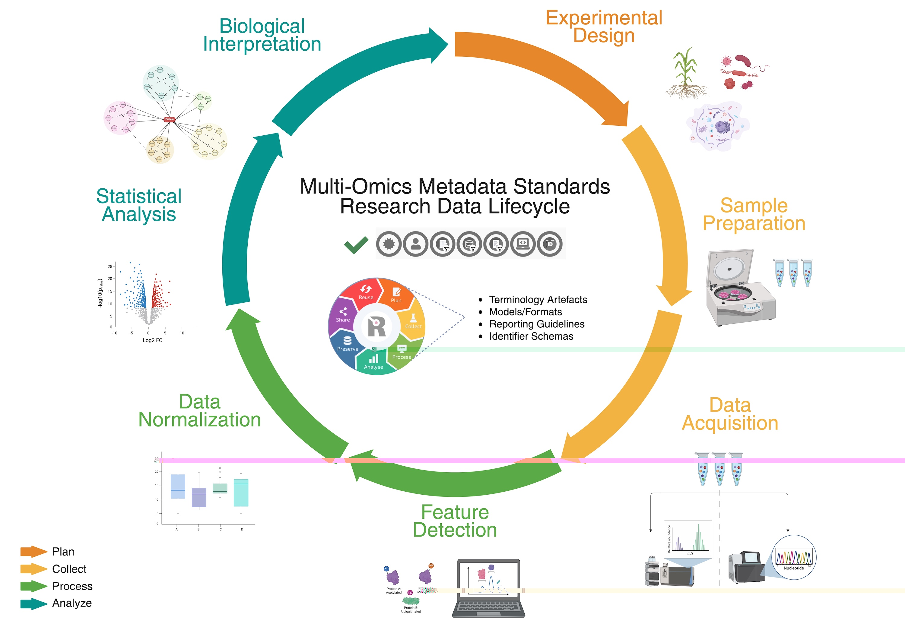

# User Journeys

MOMSI user journeys provide unique educational examples for assisting users with navigation and exploration between deliverables. Journeys explore curation activity themes covering MOMSI concepts curated in our landscape review expanding on the RDMkit research data lifecycle framework and subject domain research area terms linked to FAIRsharing standards types at our collection.

---

## MOMSI Research Data Lifecycle Journeys

The Research Data Management toolkit for Life Sciences (RDMkit)[^1] is just one of many global community resources supporting educational awareness around core data management concepts and best practices for proper handling of digital data at each stage of the research [data life cycle](https://rdmkit.elixir-europe.org/data_life_cycle). The MOMSI landscape review dashboard curation workflow includes leveraging key concepts from RDMkit (Figure 1) and expands on this work to capture how each domain or generalist standard aligns to the research data lifecycle (where applicable). Capturing domain use-case research data lifecycle curations, as part of our curation criteria, aims to provide expert level (domain-informed) recommendation resources for non-expert professionals tasked with data management planning and forecasting tasks.

> <svg xmlns="http://www.w3.org/2000/svg" width="20" height="20" viewBox="0 0 24 24" fill="none" stroke="currentColor" stroke-width="2" stroke-linecap="round" stroke-linejoin="round"><path d="M8.5 14.5A2.5 2.5 0 0 0 11 12c0-1.38-.5-2-1-3-1.072-2.143-.224-4.054 2-6 .5 2.5 2 4.9 4 6.5 2 1.6 3 3.5 3 5.5a7 7 0 1 1-14 0c0-1.153.433-2.294 1-3a2.5 2.5 0 0 0 2.5 2.5z"/></svg> Collaboration Highlight: RDA Life Science Data Infrastructures IG
>  - Working group alignments aimed to enhance research data lifecycle standard-informed decision making and educational domain-aware materials supporting data stewardship and management best practices.

*Figure 1. MOMSI WG curations expand on RDMkit plan, collect, process, and analyze stages for adding domain standard use-case context to generalist research data lifecycle frameworks.*

### MOMSI Subject Area Standard Implementations Research Data Lifecycle Journeys
Core concepts, terms, and curation activity examples incorporating RDMkit use-case considerations represent potential standard selections based on different data management [roles](https://rdmkit.elixir-europe.org/your_role) and [tasks](https://rdmkit.elixir-europe.org/your_tasks) performed at each stage of the research data lifecycle (Planning, Collecting, Processing, Analyzing, Preserving, Sharing, Reusing). 

1. See [planning](glossary/Planning) use-case considerations for selecting established and maintained ontologies while drafting a data management plan from this [RDMkit example](https://rdmkit.elixir-europe.org/metadata_management#how-do-you-find-appropriate-vocabularies-or-ontologies) relevant to MOMSI curated [Universal standards](glossary/Universal-Standards).
2. See [collection](glossary/Collection) use-case considerations for metagenomics reporting guidelines from this [RDMkit example](https://rdmkit.elixir-europe.org/marine_metagenomics#managing-marine-metagenomic-metadata) relevant to MOMSI curated [Transcriptomics](glossary/Transcriptomics) standards.
3. See [processing](glossary/Processing) use-case considerations for mass spectrometry data file formats from this [RDMkit example](https://rdmkit.elixir-europe.org/proteomics#processing-and-analysis-of-proteomics-data) relevant to MOMSI curated [Proteomics](glossary/Proteomics) and [Metabolomics](glossary/Metabolomics) standards.
4. See [analysis](glossary/Analysis) use-case considerations for single-cell sequencing data file formats from this [RDMkit example](https://rdmkit.elixir-europe.org/single_cell_sequencing#data-analysis-steps-and-related-format-for-single-cell-sequencing) relevant to MOMSI curated [Genomics](glossary/Genomics) standards.
5. See [preservation](glossary/Preservation) use-case considerations for publishing and storing expression data from this [RDMkit example](https://rdmkit.elixir-europe.org/single_cell_sequencing#long-term-data-storage-and-accessibility) relevant to MOMSI curated [Genomics](glossary/Genomics) standards.
6. See [sharing](glossary/Sharing) use-case considerations for sharing structural predictions from this [RDMkit example](https://rdmkit.elixir-europe.org/structural_bioinformatics#storing-and-sharing-experimentally-solved-structures) relevant to MOMSI curated [Proteomics](glossary/Proteomics) standards.
7. See [reuse](glossary/Reuse) use-case considerations for persistent identifier schema selections from this [RDMkit example](https://rdmkit.elixir-europe.org/identifiers#which-type-of-identifiers-should-you-use-for-data-publication) relevant to MOMSI curated [Universal standards](glossary/Universal-Standards).

---

## MOMSI FAIRsharing Collection Journeys

The [MOMSI Collection (Deliverable 1b)](https://fairsharing.org/5742) located at FAIRsharing[^2] is a refined and filtered down collection of domain specific and Omics relevant universal terminologies, metadata reporting guidelines, data models/formats, and identifier schemas. 

New and existing standards listed in this collection have undergone an iterative in-depth landscape review process using the MOMSI curation dashboard sustainability workflow. This process involves evaluating the accuracy and completeness of each standard and the minimal information criteria required for curation. Our collection seeks to benefit and encourage continuous, open, and machine-actionable Multi-omics community standards curation, supporting evolving research data management and sharing best practices.

_Note: If you notice a standard is missing from the output results listed under a specific query below, check the standard record to make sure curations have been recently and accurately updated._

> <svg xmlns="http://www.w3.org/2000/svg" width="20" height="20" viewBox="0 0 24 24" fill="none" stroke="currentColor" stroke-width="2" stroke-linecap="round" stroke-linejoin="round"><path d="M8.5 14.5A2.5 2.5 0 0 0 11 12c0-1.38-.5-2-1-3-1.072-2.143-.224-4.054 2-6 .5 2.5 2 4.9 4 6.5 2 1.6 3 3.5 3 5.5a7 7 0 1 1-14 0c0-1.153.433-2.294 1-3a2.5 2.5 0 0 0 2.5 2.5z"/></svg> Collaboration Highlight: RDA FAIRsharing WG, FAIRsharing Community Champions
> - FAIRsharing is a community curated educational resource containing linked records representing data and metadata standards, inter-related to databases and data policies.
> - Guides users to discover, select, and implement standards located at our collection resulting  from our repository curation workflow.
> - Access machine-actionable trustworthy standard resources supporting data management tasks with confidence directly from the MOMSI dashboard. As a service provider FAIRsharing assigns unique digital object identifiers using DOI citation timestamps reflecting latest updates and access information.

### Beginner Journeys

"Beginner" journeys introduce entry level core concepts curated at the dashboard and listed at our collection. See "FAIRsharing in a nutshell"[^3] and provided [education material](https://fairsharing.org/educational) (prepared by the FAIRsharing Community Champions) to learn more about how FAIRsharing record resources can support your research endeavors.

See example queries below for a few ways to browse MOMSI WG standards aligned to your interest from our collection.

1. **Browse Standards by FAIRsharing Standard Type**
- View [Terminology Artefacts](https://fairsharing.org/5742?recordType=terminology_artefact&page=1)
- View [Reporting Guidelines](https://fairsharing.org/5742?page=1&recordType=reporting_guideline)
- View [Models/Formats](https://fairsharing.org/5742?page=1&recordType=model_and_format)
- View [Identifier Schemas](https://fairsharing.org/5742?page=1&recordType=identifier_schema)

2. **Browse Standards by MOMSI Subject Area Class**
- View [Genomics Standards](https://fairsharing.org/5742?subjects=genomics&page=1)
- View [Proteomics Standards](https://fairsharing.org/5742?subjects=proteomics&page=1)
- View [Metabolomics Standards](https://fairsharing.org/5742?subjects=metabolomics&page=1)
- View Universal [Omics Standards](https://fairsharing.org/5742?q=Omics) and/or [Subject Agnostic Standards](https://fairsharing.org/5742?q=Subject%20Agnostic)

3. **Browse Standards by MOMSI Subject Area Subclass**
- View [Transcriptomics Standards](https://fairsharing.org/5742?subjects=transcriptomics&page=1) (Genomics subclass)
- View [Epigenomics Standards](https://fairsharing.org/5742?subjects=epigenomics&page=1) (Genomics subclass)
- View [Metaproteomics Standards](https://fairsharing.org/5742?subjects=metaproteomics&page=1) (Proteomics subclass)
- View [Lipidomics Standards](https://fairsharing.org/5742?subjects=lipidomics&page=1) (Metabolomics subclass)

4. **Browse Standards by Domain Application Technology**
- View Standards linked to [Sequencing](https://fairsharing.org/5742?q=Sequencing)
- View Standards linked to [Mass spectrometry](https://fairsharing.org/5742?q=Mass%20Spectrometry)

### Advanced Journeys

"Advanced" journeys provide a more in-depth view of standards listed across multiple Omics domains and standard types curated at the dashboard and listed at our collection. See "FAIRsharing content: standards overview"[^4] and "FAIR Principles in a nutshell"[^5] to learn more about how combined Omics standards and Universal standards can support FAIR research developments.

1. **Browse MOMSI Curations by Domain vs. Universal Standard Types**

   - View Terminology Artefacts examples representing Universal (generalist) standard curations relevant to Omics for [BFO](https://doi.org/10.25504/FAIRsharing.wcpd6f), [T4FS](https://doi.org/10.25504/FAIRsharing.fb99fa), [EDAM](https://doi.org/10.25504/FAIRsharing.a6r7zs) **vs.** Omics Domain representative examples such as [EFO](https://doi.org/10.25504/FAIRsharing.1gr4tz), [PSI-MS CV](https://doi.org/10.25504/FAIRsharing.sxh2dp), [XLMOD](https://doi.org/10.25504/FAIRsharing.6ccbe6).
  
   - View Reporting Guideline examples representing Universal (generalist) standard curations for [FORCE11 Data Citation Principles](https://doi.org/10.25504/FAIRsharing.9hynwc) or the [FAIR Principles](https://doi.org/10.25504/FAIRsharing.WWI10U) **vs.** Omics Domain representative examples such as [MIxS](https://doi.org/10.25504/FAIRsharing.9aa0zp), [MIAPE](https://doi.org/10.25504/FAIRsharing.5g1fma), [LSI Checklist](https://doi.org/10.25504/FAIRsharing.ffb40f).
  
   - View Model or Format examples representing Universal (generalist) standard curations for [ISO 8601](https://doi.org/10.25504/FAIRsharing.987d5a), [OWL](https://doi.org/10.25504/FAIRsharing.atygwy), [ISA-TAB](https://doi.org/10.25504/FAIRsharing.53gp75) **vs.** Omics Domain representative examples such as [FASTA](https://doi.org/10.25504/FAIRsharing.rz4vfg), [mzML](https://doi.org/10.25504/FAIRsharing.26dmba), [HDF5](https://doi.org/10.25504/FAIRsharing.wvgta9).
  
   - View Identifier Schema examples representing Universal (generalist) standard curations for [DOI](https://doi.org/10.25504/FAIRsharing.hFLKCn), [CURIE](https://doi.org/10.25504/FAIRsharing.af21db), [ORCID](https://doi.org/10.25504/FAIRsharing.OrNi1L) **vs.** Omics Domain representative examples such as [Biosample ID](https://doi.org/10.25504/FAIRsharing.322dc0), [UniProt ID](https://doi.org/10.25504/FAIRsharing.fd6003), [InChI](https://doi.org/10.25504/FAIRsharing.ddk9t9).

2. **Browse MOMSI Curations by Relevant Submission Criteria**

    _Note: render times for each query may take a few minutes based on the size and complexity of the established relationships._

   - View standards affiliated efforts by the [Genomic Standards Consortium (GSC)](https://fairsharing.org/5742?page=1&organisations=genomic%2520standards%2520consortium), [European Bioinformatics Institute (EBI)](https://fairsharing.org/5742?page=1&organisations=european%2520bioinformatics%2520institute), [HUPO Proteomics Standards Initiative (HUPO-PSI)](https://fairsharing.org/5742?page=1&organisations=proteomics%2520standards%2520initiative%2520%28psi%29%2520-%2520human%2520proteomics%2520organisation%2520%28hupo%29), or the [International Organization for Standardization (ISO)](https://fairsharing.org/5742?page=1&organisations=international%2520organization%2520for%2520standardization%2520%28iso%29).
   - View standards being [actively maintained](https://fairsharing.org/5742?page=1&isMaintained=true) by corresponding affiliated organizations.
   - View standards that are currently still [in development](https://fairsharing.org/5742?page=1&status=in_development).
   - View standards that are [recommended](https://fairsharing.org/5742?page=1&isRecommended=true) by a data policy from a journal, journal publisher or funder.
   - View the [MOMSI collection network graph](https://fairsharing.org/graph/5742) to explore how curation standards are interlinked to databases, standards, and policies.

**References**

[^1]: RDMkit: The ELIXIR Research Data Management toolkit for Life Sciences URL: [https://rdmkit.elixir-europe.org](https://rdmkit.elixir-europe.org/) (Accessed 2025-04-12).

[^2]: Sansone, SA., McQuilton, P., Rocca-Serra, P. _et al._ FAIRsharing as a community approach to standards, repositories and policies. _Nat Biotechnol_ 37, 358–367 (2019). https://doi.org/10.1038/s41587-019-0080-8

[^3]: Allyson Lister, & Susanna-Assunta Sansone. (2023, July 28). FAIRsharing in a nutshell. Zenodo. https://doi.org/10.5281/zenodo.8191958

[^4]: Malin Sandström, Allyson Lister, & Susanna-Assunta Sansone. (2023, July 26). FAIRsharing content: standards overview. Zenodo. https://doi.org/10.5281/zenodo.8186982

[^5]: Lister, A., Sansone, S.-A., & Rocca-Serra, P. (2024, June 19). FAIR Principles in a nutshell. Zenodo. https://doi.org/10.5281/zenodo.12167786
